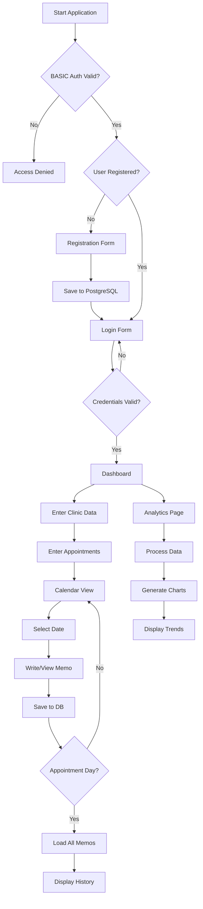

# Clinic Note - Medical Appointment Management System

## Overview

Clinic Note is a comprehensive medical appointment management system that allows users to track hospital visits, medications, and analyze health trends over time.

## System Architecture

### Technology Stack

**Frontend (Vercel)**
- Alpine.js - Reactive framework
- HTMX - Dynamic content loading
- TailwindCSS - Styling
- Hyperscript - Scripting
- AOS - Animations
- Swiper - Carousels
- Lottie-web - Animations
- Shoelace - Web components
- Iconify - Icons
- MotionOne - Animations
- SVG - Graphics
- LocalStorage - Client storage
- IndexedDB - Client database
- PouchDB - Sync database
- CouchDB - Remote database

**Backend (Render)**
- Node.js
- Express.js
- PostgreSQL (Render)
- BASIC Authentication (JavaScript Pseudo)

**Database (Supabase PostgreSQL)**
- User authentication data
- Clinic records
- Appointment schedules
- Medical notes

**Analytics (Render)**
- Data processing service
- Trend analysis
- Health metrics

**Contact (EmailJS)**
- Provide BASIC Authentication credentials
- Response other contacts

## Algorithm Flow

### Authentication Flow

```
START
  ↓
Initial BASIC Auth (clinic-note-api.onrender.com)
  ↓
Enter BASIC_USER & BASIC_PASSWORD
  ↓
Valid? → NO → Reject Access
  ↓ YES
Display Registration/Login Page
  ↓
New User? → YES → Register (Username + Password)
  ↓              ↓
  NO             Save to Database
  ↓              ↓
Login with Credentials ←┘
  ↓
Verify from Database
  ↓
Valid? → NO → Return to Login
  ↓ YES
Access Dashboard
  ↓
END
```

### Data Entry Flow

```
START (Authenticated User)
  ↓
Enter Hospital Name
  ↓
Enter Medical Department
  ↓
Enter Diagnosis
  ↓
Enter Medication
  ↓
Save to Database
  ↓
Enter Next Appointment Date(s)
  ↓
Multiple Hospitals? → YES → Repeat Entry
  ↓ NO               ↓
Multiple Departments? → YES → Repeat Entry
  ↓ NO                ↓
Multiple Dates/Times? → YES → Repeat Entry
  ↓ NO                 ↓
Save All Appointments ←┘
  ↓
END
```

### Calendar & Memo Flow

```
START (Dashboard)
  ↓
Select Hospital
  ↓
Select Medical Department
  ↓
Display Current Month Calendar
  ↓
Highlight Today's Date
  ↓
Display Memo Textarea
  ↓
User Clicks Date → Past/Future Date?
  ↓                ↓
Enter Memo         Load Existing Memo
  ↓                ↓
Save to Database ←┘
  ↓
Appointment Day? → NO → Continue
  ↓ YES
Load All Memos for Selected Hospital/Dept
  ↓
Display Memo History
  ↓
END
```

### Analytics Flow

```
START (Analytics Page)
  ↓
Load All User Data from Database
  ↓
Group by Medical Department
  ↓
For Each Department:
  ↓
  Calculate Visit Frequency
  ↓
  Analyze Medication Patterns
  ↓
  Identify Trends
  ↓
  Generate Charts
  ↓
Display Analytics Dashboard
  ↓
END
```

## Flowchart Diagram



## Arrow Diagram (PERT Chart)

```
[BASIC Auth] → [User Check] → [Register/Login]
      ↓              ↓              ↓
   [Validate]   [DB Query]    [Save User]
      ↓              ↓              ↓
   [Access] ←────[Verify]←────[Complete]
      ↓
   [Dashboard] ──→ [Data Entry] ──→ [Save Clinic Info]
      ↓                                    ↓
   [Calendar] ←─────────────────────────[Appointments]
      ↓
   [Memo System] ──→ [Date Selection] ──→ [Save/Load]
      ↓                                       ↓
   [Analytics] ←──────────────────────────[DB Query]
      ↓
   [Trend Analysis] ──→ [Chart Generation] ��→ [Display]
```

## Database Schema

### Users Table
```sql
CREATE TABLE users (
  id SERIAL PRIMARY KEY,
  username VARCHAR(255) UNIQUE NOT NULL,
  password_hash VARCHAR(255) NOT NULL,
  created_at TIMESTAMP DEFAULT CURRENT_TIMESTAMP
);
```

### Clinics Table
```sql
CREATE TABLE clinics (
  id SERIAL PRIMARY KEY,
  user_id INTEGER REFERENCES users(id),
  hospital_name VARCHAR(255) NOT NULL,
  department VARCHAR(255) NOT NULL,
  diagnosis TEXT,
  medication TEXT,
  created_at TIMESTAMP DEFAULT CURRENT_TIMESTAMP
);
```

### Appointments Table
```sql
CREATE TABLE appointments (
  id SERIAL PRIMARY KEY,
  user_id INTEGER REFERENCES users(id),
  clinic_id INTEGER REFERENCES clinics(id),
  appointment_date DATE NOT NULL,
  appointment_time TIME,
  created_at TIMESTAMP DEFAULT CURRENT_TIMESTAMP
);
```

### Memos Table
```sql
CREATE TABLE memos (
  id SERIAL PRIMARY KEY,
  user_id INTEGER REFERENCES users(id),
  clinic_id INTEGER REFERENCES clinics(id),
  memo_date DATE NOT NULL,
  content TEXT,
  created_at TIMESTAMP DEFAULT CURRENT_TIMESTAMP,
  updated_at TIMESTAMP DEFAULT CURRENT_TIMESTAMP
);
```

## Deployment Configuration

### Vercel (Frontend)
- **Build Command**: `npm run build`
- **Output Directory**: `public`
- **Install Command**: `npm install`
- **Environment Variables**:
  - `VITE_API_URL=https://clinic-note-api.onrender.com`

### Render (Backend API)
- **Root Directory**: `backend`
- **Build Command**: `npm install`
- **Start Command**: `node src/server.js`
- **Region**: `Oregon (US West)`
- **Environment Variables**:
  - `DATABASE_URL` (from Render PostgreSQL)
  - `BASIC_USER=admin`
  - `BASIC_PASSWORD=secure_password_123`
  - `JWT_SECRET=your_jwt_secret_key_here`
  - `NODE_ENV=production`
  - `PORT=10000`

### Render PostgreSQL
- **Name**: `clinic-note-db`
- **Database**: `clinic_note`
- **User**: `clinic_note_user`
- **PostgreSQL Version**: `16`
- **Region**: `Oregon (US West)`

### Datadog (Optional Monitoring)
- **Datadog API Key**: `your_datadog_api_key`
- **Datadog Region**: `US1`

## Installation Steps

1. Clone repository
2. Install frontend dependencies: `cd frontend && npm install`
3. Install backend dependencies: `cd backend && npm install`
4. Configure environment variables
5. Deploy frontend to Vercel
6. Deploy backend to Render
7. Create PostgreSQL database on Render
8. Run database migrations

## Features

- ✅ Multi-language support (Japanese/English)
- ✅ Secure authentication
- ✅ Multiple hospital/department tracking
- ✅ Calendar-based memo system
- ✅ Appointment reminders
- ✅ Health trend analytics
- ✅ Responsive design
- ✅ Offline capability (IndexedDB/PouchDB)
- ✅ Data synchronization

## Caution
- ***You need to update and reflect PostgreSQL on Render if you have a free plan.***

## License

MIT License

## Support

For issues and questions, please open an issue on GitHub.
